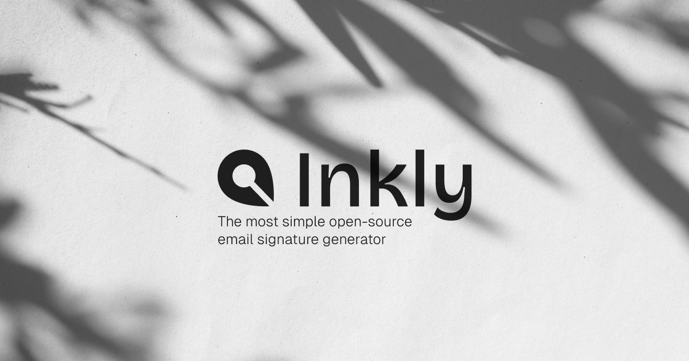

<p align="center">
    <a aria-label="Inkly's Website" href="https://inkly.hrcd.fr">
        
<a aria-label="Hugo's Website" href="https://hrcd.fr">
        
  <a aria-label="License" href="https://github.com/hugorcd/inkly/blob/master/LICENSE">
    
    </a>
  <a aria-label="Follow Hugo on Twitter" href="https://twitter.com/HugoRCD__">
    
  </a>
</p>

# Inkly

Inkly is a simple open-source email signature generator made with [Nuxt](https://nuxt.com/) and [Tailwind CSS](https://tailwindcss.com/).

## Live website

You can see it live at [inkly.hrcd.fr](https://inkly.hrcd.fr/).

## Quick Setup

1. Clone this repository if you have access or download it from the store
```bash
git clone git@github.com:HugoRCD/inkly.git
```

2. Install dependencies
```bash
bun install
```

3. Start development server
```bash
bun dev
```

4. Generate static project
```bash
bun generate
```

5. Start production server
```bash
bun start
```

<!-- automd:fetch url="gh:hugorcd/markdown/main/src/contributions.md" -->

## Contributing
To start contributing, you can follow these steps:

1. First raise an issue to discuss the changes you would like to make.
2. Fork the repository.
3. Create a branch using conventional commits and the issue number as the branch name. For example, `feat/123` or `fix/456`.
4. Make changes following the local development steps.
5. Commit your changes following the [Conventional Commits](https://www.conventionalcommits.org/en/v1.0.0/) specification.
6. If your changes affect the code, run tests using `bun run test`.
7. Create a pull request following the [Pull Request Template](https://github.com/HugoRCD/markdown/blob/main/src/pull_request_template.md).
   - To be merged, the pull request must pass the tests/workflow and have at least one approval.
   - If your changes affect the documentation, make sure to update it.
   - If your changes affect the code, make sure to update the tests.
8. Wait for the maintainers to review your pull request.
9. Once approved, the pull request will be merged in the next release !

<!-- /automd -->

<!-- automd:fetch url="gh:hugorcd/markdown/main/src/local_development_dev.md" -->

<details>
  <summary>Local development</summary>

- Clone this repository
- Install latest LTS version of [Node.js](https://nodejs.org/en/)
- Enable [Corepack](https://github.com/nodejs/corepack) using `corepack enable`
- Install dependencies using `bun install`
- Start development server using `bun dev`
- Open [http://localhost:3000](http://localhost:3000) in your browser

</details>

<!-- /automd -->

<!-- automd:contributors license=Apache author=HugoRCD github="hugorcd/inkly" -->

Published under the [APACHE](https://github.com/hugorcd/inkly/blob/main/LICENSE) license.
Made by [@HugoRCD](https://github.com/HugoRCD) and [community](https://github.com/hugorcd/inkly/graphs/contributors) 💛
<br><br>
<a href="https://github.com/hugorcd/inkly/graphs/contributors">

</a>

<!-- /automd -->

<!-- automd:with-automd lastUpdate -->

---

_🤖 auto updated with [automd](https://automd.unjs.io) (last updated: Sat Aug 31 2024)_

<!-- /automd -->
